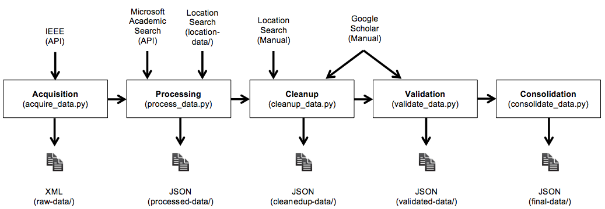
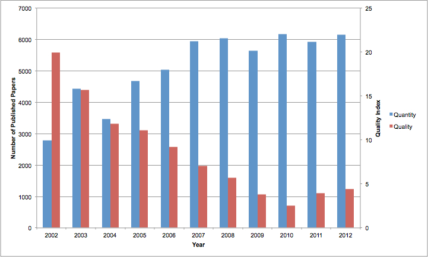
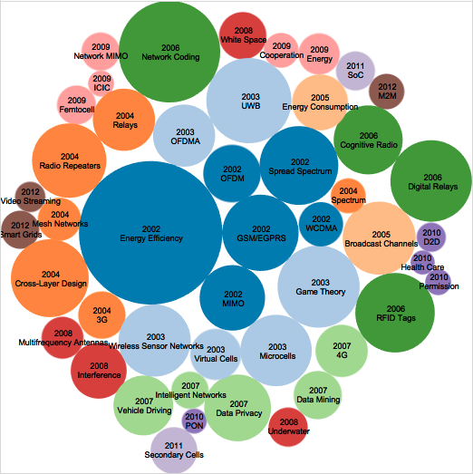
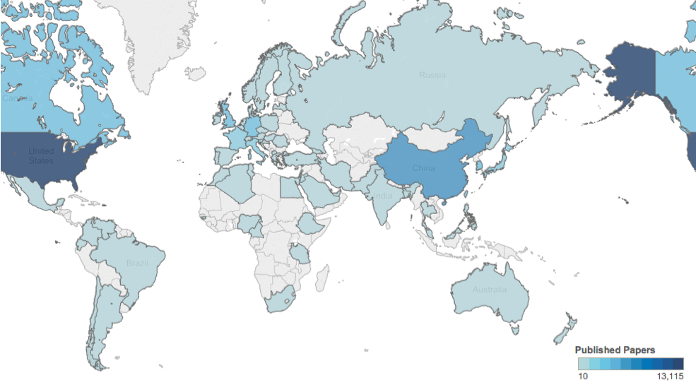
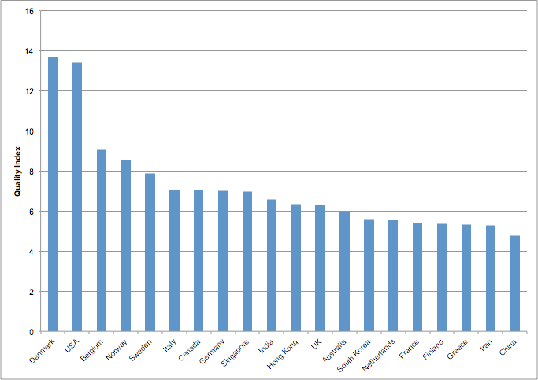
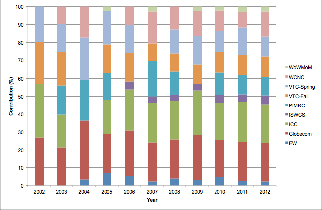
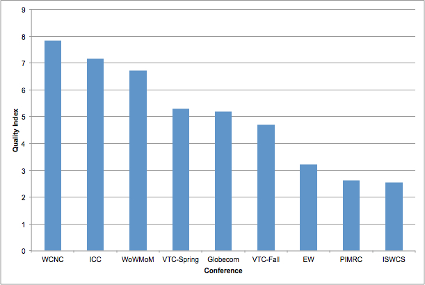
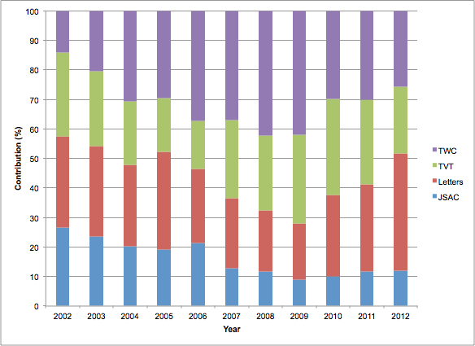
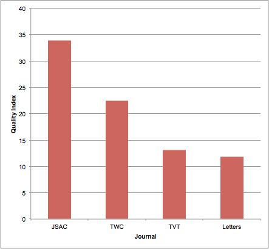

Communications Research
=====
This Python project under [Communications-Research](https://github.com/thampiman/Data-Science/tree/master/Communications-Research) analyses trends in wireless communications research from 2002-2012. Meta-data of major conferences and journals are obtained programmatically from the [IEEE](http://ieeexplore.ieee.org/gateway/) database. The citations are then obtained from [Microsoft Academic Search](http://academic.research.microsoft.com/) (programmatically) and [Google Scholar](http://scholar.google.com) (manually). The location of the primary authors of the papers are also obtained from the [MaxMind](https://www.maxmind.com/en/worldcities) world cities database (programmatically) and [Google](http://google.com) (manually). All this information is analysed to obtain trends in the past decade. 

## The Data

## Metrics and Preliminary Analysis

## Top Trends

## Top Countries

## Contributions and Rankings of Conferences and Journals

License
=====
The MIT License (MIT)